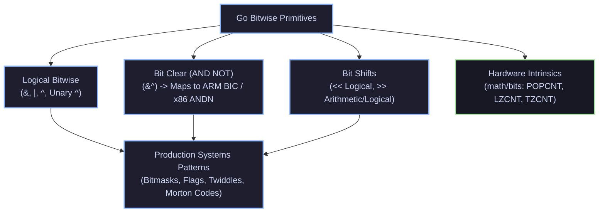

# ⚡ Bitwise Operations

Comprehensive guide to low-level bitwise manipulation, binary arithmetic, hardware intrinsics, and bitmasking patterns in Go.



---

## 🗂️ Knowledge Deep-Dive

```text
Bitwise Operations
│
├── [[Bitwise AND, OR, XOR]]
│   ├── Bitwise AND (&), OR (|), XOR (^) Truth Tables
│   ├── Unary Bitwise NOT (^) Complement Invariants
│   └── Go vs C Operator Precedence Differences
│
├── [[Bit Clear Operator (&^)]]
│   ├── Go-Specific AND NOT Binary Operator Invariants
│   ├── Hardware Mapping: ARM BIC & x86-64 BMI1 ANDN
│   └── Atomic Flag Clears with Compare-And-Swap (CAS)
│
├── [[Bit Shift Operations (<<, >>)]]
│   ├── Logical Left Shift (<<) & Integer Bounds
│   ├── Logical Right Shift (Unsigned) vs Arithmetic Right Shift (Signed)
│   └── Strict Unsigned Shift Count Type Invariant in Go
│
├── [[math-bits Standard Package]]
│   ├── Direct Compiler Intrinsics (POPCNT, LZCNT, TZCNT, BSWAP)
│   ├── Fast Bit Length (Len64) & Next Power-of-Two Calculations
│   └── 128-Bit Multi-Precision Arithmetic (Add64, Mul64, Div64)
│
├── [[Bitmasking and Bit Flags Patterns]]
│   ├── Zero-Allocation High-Density State Packing
│   ├── Atomic Bitmask Transitions in Concurrent Systems
│   └── Submask Testing & Permission Verification
│
└── [[Bit Manipulation Hacks and Twiddles]]
    ├── Brian Kernighan's Bit Counting Algorithm
    ├── Isolating & Clearing Lowest Set Bits (x & -x, x & x-1)
    ├── Branchless Min, Max, and Absolute Value
    └── Morton Codes (Z-Order 2D Curve Packing)
```

---

## 🗂️ Topics

- [[Bitwise AND, OR, XOR]] — Standard bitwise arithmetic, binary operators, and unary bitwise complement in Go.
- [[Bit Clear Operator (&^)]] — Go-specific AND NOT operator for clearing specific bits in a mask.
- [[Bit Shift Operations (<<, >>)]] — Left shift multiplication and right shift division with logical vs arithmetic sign propagation.
- [[math-bits Standard Package]] — Hardware compiler intrinsics for leading zeros, trailing zeros, popcount, and multi-word arithmetic.
- [[Bitmasking and Bit Flags Patterns]] — Production idioms for permission bitfields, state management, and atomic flag transitions.
- [[Bit Manipulation Hacks and Twiddles]] — High-performance branchless algorithms, power-of-two checks, and low-level bit twiddling.

---

## 🔗 References
- ⬆️ Parent: [[Variables & Constants]]
- 📚 Module: `Language Basics`
