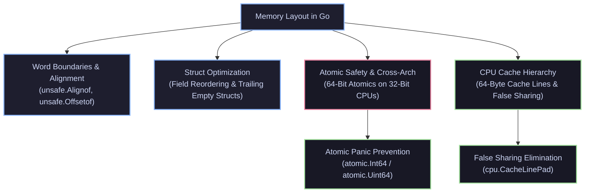

# 📐 Memory Alignment & Atomic Safety

Comprehensive systems engineering guide to hardware word boundaries, struct padding optimization, 64-bit alignment constraints on 32-bit architectures, CPU cache line false sharing, and atomic panic prevention in Go.



---

## 🗂️ Knowledge Deep-Dive

```text
Memory Alignment & Atomic Safety
│
├── [[64-Bit Alignment on 32-Bit Archs]]
│   ├── Natural Alignment on 32-bit CPUs vs 64-bit Hardware Atomics
│   ├── Fatal Unaligned Atomic Panic Invariants
│   └── Cross-Platform CI Emulation (GOARCH=386)
│
├── [[Atomic Panic Prevention]]
│   ├── Typed Atomics (atomic.Int64, atomic.Uint64, atomic.Pointer)
│   ├── Offset 0 Struct Placement Rules for Legacy Codebases
│   └── noCopy Semantic Protection
│
├── [[Struct Field Reordering for Alignment]]
│   ├── Natural Alignment Formula & Padding Calculations
│   ├── Descending Field Order Optimization (Minimizing Padding Waste)
│   └── Automated Tooling (fieldalignment -fix ./...)
│
├── [[Cache Line False Sharing and Alignment]]
│   ├── 64-Byte / 128-Byte CPU Cache Line Architecture
│   ├── MESI Coherence Bus Thrashing (HITM Invalidation Storms)
│   └── Isolation via golang.org/x/sys/cpu.CacheLinePad
│
├── [[Zero-Size Fields & Trailing Struct Padding]]
│   ├── The Trailing struct{} Memory Inflation Invariant (+8 Bytes)
│   ├── Protecting Pointers from Crossing Heap Allocation Boundaries
│   └── Placement Rules for struct{} and [0]byte
│
└── [[unsafe.Alignof and unsafe.Offsetof Invariants]]
    ├── Compile-Time Struct Memory Reflection
    ├── Natural Alignment Table Across All Go Types
    └── Zero-Cost Compile-Time Struct Layout Assertions
```

---

## 🗂️ Topics

- [[64-Bit Alignment on 32-Bit Archs]] — Why 64-bit atomic operations panic on unaligned 32-bit memory boundaries and cross-platform mitigation.
- [[Atomic Panic Prevention]] — Using `atomic.Int64` / `atomic.Uint64` typed wrappers or offset-0 placement to eliminate unaligned atomic panics.
- [[Struct Field Reordering for Alignment]] — Eliminating internal padding bytes by ordering struct fields from largest to smallest.
- [[Cache Line False Sharing and Alignment]] — Eliminating multi-core MESI cache ping-ponging using `cpu.CacheLinePad`.
- [[Zero-Size Fields & Trailing Struct Padding]] — How trailing `struct{}` fields trigger word-sized padding inflation and how to structure empty fields.
- [[unsafe.Alignof and unsafe.Offsetof Invariants]] — Low-level memory reflection, alignment factor guarantees, and compile-time struct assertions.

---

## 🔗 References
- ⬆️ Parent: [[Variables & Constants]]
- 📚 Module: `Language Basics`
